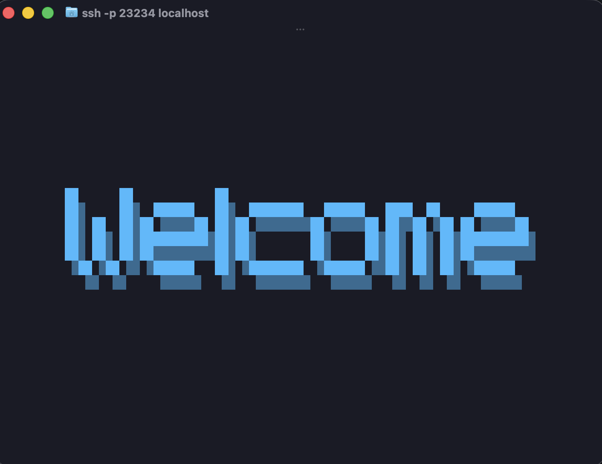

# wish-splash
A middleware for displaying an in-console splash screen for wish-ssh apps



Display wonderful splash screens in your Charm wish SSH apps.
[https://github.com/charmbracelet/wish](https://github.com/charmbracelet/wish)
This is done using the [https://github.com/superstarryeyes/bit](https://github.com/superstarryeyes/bit)
library. Simply define your options and invoke the middleware. The rest is taken care of for you.

# Features

* Renders a beautiful text banner in the console via the bit library.
* Automatically centers the text in the middle of the terminal
* Automatically resizes the text if it can't fit in the terminal
* Dynamically resizes the text if the window size changes

# How to Use

First you need to configure your banner options. These will include all the options present
in `superstarryeye's` bit library plus a delay which is the number of seconds the screen will display.

```
	// Setup your bit and splash screen options
	opts := wishsplash.Options{
		Font:  "8bitfortress",
		Text:  "Welcome",
		Delay: 3, // Number of seconds the splash screen will display
		RenderOptions: ansifonts.RenderOptions{
			CharSpacing:            1,
			WordSpacing:            1,
			LineSpacing:            2,
			TextColor:              "3BBBFF",
			GradientColor:          "#00FF00",
			UseGradient:            false,
			GradientDirection:      ansifonts.LeftRight,
			Alignment:              ansifonts.RightAlign,
			ScaleFactor:            1.0,
			ShadowEnabled:          true,
			ShadowHorizontalOffset: 1,
			ShadowVerticalOffset:   1,
			ShadowStyle:            ansifonts.MediumShade,
		},
	}
```

Then when you create your wish ssh server, include it will all your other middleware.
```
	srv, err := wish.NewServer(
		wish.WithAddress(net.JoinHostPort(host, port)),
		wish.WithHostKeyPath(".ssh/id_ed25519"),

		wish.WithMiddleware(
			func(next ssh.Handler) ssh.Handler {
				return func(sess ssh.Session) {
					wish.Println(sess, "Hello, world!")
					next(sess)
				}
			},

			// Add your splash screen middleware. Middleware is executed in reverse
			// order so you will want to add it towards the end
			logging.Middleware(),
			wishsplash.WithOptions(opts),
		),
	)
```
There is a complete working example in the `examples` directory.

You can also pass a custom logger to the wishsplash middleware, although you probably won't
want to unless you are troubleshooting something with it.

```
import(
  charmLog "charm.land/log/v2"
)

...

	charmLogger := charmLog.New(os.Stderr)
	charmLogger.SetLevel(charmLog.DebugLevel)

...


			wishsplash.WithLogger(opts,logger),
```


